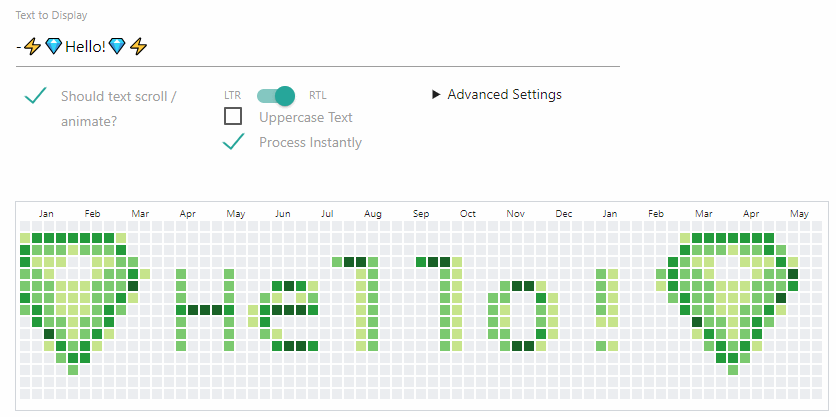
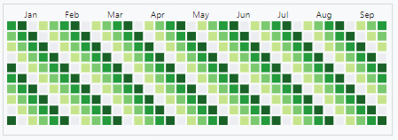

# github-contributions-mock

## Hosted Version
Check it out on Glitch!
 - [App](https://joshuatz-github-contributions-mock.glitch.me)
 - 

## What is this?
Purely for-fun little app / webpage to mock text and/or emoji appearing in a Github "contributions graph". Uses React + JS + HTML + CSS, and also relies heavily on the [Canvas API](https://developer.mozilla.org/en-US/docs/Web/API/Canvas_API) to convert text characters into a point array format.

## Demo

Pattern (left-to-right):

## TODO
 - Performance could use some improvements
	- Primarily in `textToDataArr` - I think caching each character would help, but need to fix some bugs to get that to work

## Development
 - This project was bootstrapped with [Create React App](https://github.com/facebook/create-react-app).
	 - `yarn start`
 - I'm using JSDoc for type annotation / JS type checking with VSCode
